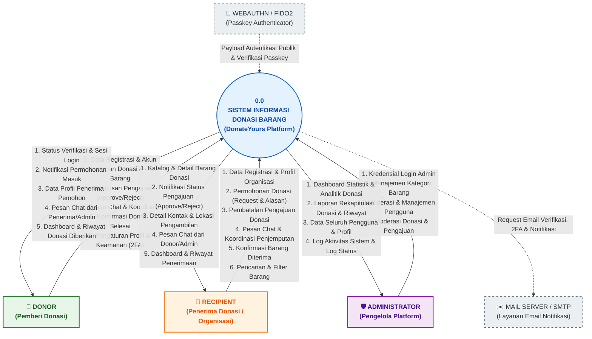

# Dokumentasi Context Diagram (DFD Level 0) - DonateYours

Dokumen ini berisi penjelasan detail dan spesifikasi **Diagram Konteks (*Context Diagram* / DFD Level 0)** untuk sistem aplikasi **DonateYours** (Sistem Informasi Donasi Barang Bekas Layak Pakai).

File diagram Draw.io dapat diakses pada: [`docs/context_diagram.drawio`](context_diagram.drawio).

---

## 1. Visualisasi Diagram Konteks (Mermaid)

---

## 2. Struktur Halaman pada `docs/context_diagram.drawio`

File [`docs/context_diagram.drawio`](context_diagram.drawio) memiliki 2 halaman utama:

1. **Halaman 1: `1. Diagram Konteks (Utama)`**  
   Fokus pada interaksi 3 entitas luar utama: **Donor**, **Recipient**, dan **Administrator** terhadap Sistem Utama `0.0`.
2. **Halaman 2: `2. Diagram Konteks (+ Layanan Eksternal)`**  
   Menyertakan layanan eksternal (*third-party services*): **WebAuthn/Passkey Authenticator** dan **Mail Server/SMTP Service**.

---

## 3. Rincian Entitas Luar (*External Entities / Terminators*)

### 3.1. Entitas: **DONOR (Pemberi Donasi)**
Pengguna perorangan atau pihak yang mendonasikan barang bekas layak pakai ke platform.

#### Aliran Data Masuk (*Input to System*):
- **Data Registrasi & Akun**: Nama, email, password, nomor telepon, dan foto avatar.
- **Data Postingan Donasi & Foto**: Judul barang, deskripsi, kategori, kondisi barang, jumlah (*quantity*), alamat pengambilan (*pickup address*), kota, provinsi, dan file foto/gambar.
- **Keputusan Pengajuan Donasi**: Tindakan menyetujui (*Approve*) atau menolak (*Reject*) permohonan yang diajukan oleh Recipient.
- **Pesan Chat**: Komunikasi langsung dengan pemohon untuk membahas teknis serah terima / penjemputan barang.
- **Konfirmasi Donasi Selesai**: Penandaan bahwa barang telah berhasil diambil / diserahkan (*Completed*).
- **Pengaturan Profil & Keamanan**: Pengaturan two-factor authentication (2FA), perubahan sandi, dan pendaftaran passkey.

#### Aliran Informasi Keluar (*Output from System*):
- **Status Verifikasi & Sesi Login**: Notifikasi email terverifikasi dan status login akun.
- **Notifikasi Permohonan Donasi Masuk**: Pemberitahuan saat ada penerima yang mengajukan minat terhadap barang yang didonasikan.
- **Data Profil Pemohon**: Informasi profil, nama organisasi, domisili, dan deskripsi kebutuhan penerima.
- **Pesan Chat Masuk**: Pesan teks dari calon penerima atau administrator.
- **Dashboard & Riwayat Donasi**: Statistik total donasi yang diposting, donasi aktif, dan riwayat donasi yang telah selesai.

---

### 3.2. Entitas: **RECIPIENT (Penerima Donasi / Organisasi / Yayasan)**
Pihak penerima manfaat (pribadi atau lembaga/organisasi/panti asuhan) yang mencari dan mengajukan permohonan donasi.

#### Aliran Data Masuk (*Input to System*):
- **Data Registrasi & Profil Organisasi**: Nama organisasi, alamat lengkap, kota, provinsi, deskripsi yayasan/latar belakang, dan foto profil/legalitas.
- **Permohonan Pengajuan Donasi**: Pesan/alasan kebutuhan saat meminta barang donasi tertentu.
- **Pembatalan Pengajuan Donasi**: Permintaan membatalkan pengajuan yang masih berstatus pending.
- **Pesan Chat & Koordinasi Penjemputan**: Komunikasi terkait waktu dan teknis pengambilan barang dengan donor.
- **Konfirmasi Penerimaan Barang**: Konfirmasi bahwa barang donasi telah diterima dengan baik.
- **Pencarian & Filter Kategori**: Kata kunci pencarian barang dan pemilihan filter kategori/lokasi.

#### Aliran Informasi Keluar (*Output from System*):
- **Katalog & Detail Barang Donasi**: Daftar barang donasi yang dipublikasikan lengkap dengan foto, deskripsi, kondisi, dan lokasi.
- **Notifikasi Status Pengajuan**: Update status pengajuan apakah `pending`, `approved`, `rejected`, atau `completed`.
- **Detail Kontak & Lokasi Pengambilan**: Alamat lengkap pengambilan barang dari donor setelah permohonan disetujui.
- **Pesan Chat Masuk**: Respons dan arahan penjemputan dari donor/admin.
- **Dashboard & Riwayat Penerimaan**: Rekapitulasi pengajuan aktif dan riwayat barang donasi yang berhasil diperoleh.

---

### 3.3. Entitas: **ADMINISTRATOR (Pengelola Platform)**
Pengelola internal yang bertanggung jawab atas pengawasan, kelancaran operasional, dan pengelolaan data master platform.

#### Aliran Data Masuk (*Input to System*):
- **Kredensial Login Admin**: Email dan kata sandi khusus administrator.
- **Manajemen Kategori Barang**: Penambahan nama kategori baru, pengubahan ikon/nama, dan penghapusan kategori donasi.
- **Moderasi & Manajemen Pengguna**: Pemantauan akun donor dan penerima, verifikasi profil organisasi, atau tindakan suspend/blokir pengguna bermasalah.
- **Moderasi Donasi & Pengajuan**: Pengawasan konten postingan donasi agar sesuai norma dan syarat ketentuan platform.

#### Aliran Informasi Keluar (*Output from System*):
- **Dashboard Analitik & Statistik**: Grafik jumlah donasi, total transaksi serah terima, rasio donor vs recipient, dan statistik bulanan.
- **Laporan Rekapitulasi Donasi & Riwayat**: Laporan komprehensif data barang yang telah disalurkan beserta log penyelesaiannya.
- **Data Seluruh Pengguna**: Daftar seluruh pengguna terdaftar, peran akun, dan profil detail penerima.
- **Log Aktivitas Sistem & Log Status**: Catatan audit trail tindakan pengguna (*activity logs*) dan rekam jejak riwayat status (*request logs*).

---

### 3.4. Entitas Layanan Eksternal (*External Services*)

#### A. **WebAuthn / FIDO2 (Passkey Authenticator)**
- **Aliran Masuk ke Sistem**: Kredensial publik WebAuthn, signature biometrik, dan validasi kunci keamanan perangkat.
- **Aliran Keluar dari Sistem**: Tantangan autentikasi (*challenge payload*) untuk otentikasi login tanpa kata sandi.

#### B. **Mail Server / SMTP (Layanan Notifikasi Email)**
- **Aliran Keluar dari Sistem**: Permintaan pengiriman email aktivasi/verifikasi akun, reset password, dan pemberitahuan transaksi donasi.

---

## 4. Cara Membuka & Mengedit File `context_diagram.drawio`

1. **Via Browser**:
   - Buka [app.diagrams.net](https://app.diagrams.net/)
   - Pilih `File` > `Open From` > `Device...` lalu pilih [`docs/context_diagram.drawio`](context_diagram.drawio).
2. **Via VS Code**:
   - Instal ekstensi **Draw.io Integration**.
   - Buka file [`docs/context_diagram.drawio`](context_diagram.drawio) langsung di VS Code.
