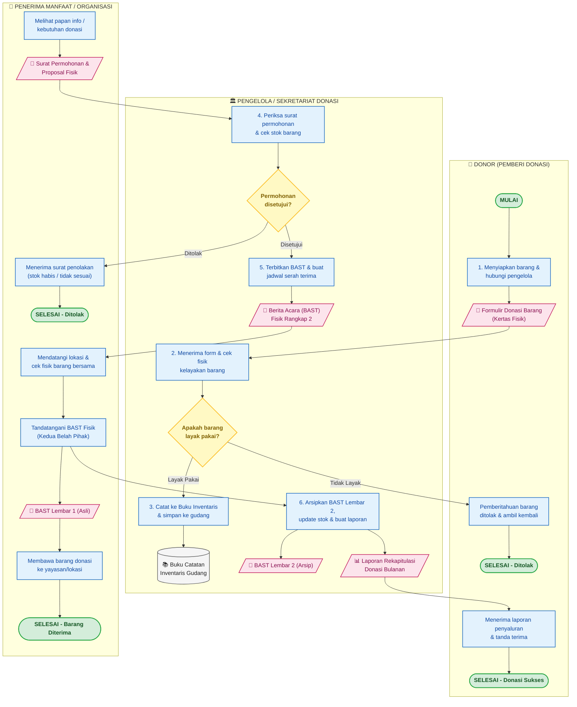

# Dokumentasi Flowchart Prosedur Manual - Donasi Barang

Dokumen ini berisi dokumentasi dan spesifikasi **Flowchart Sistem / Prosedur Manual (*Conventional Business Process Flowchart*)** untuk alur pengelolaan dan penyaluran donasi barang bekas layak pakai secara konvensional (SOP sebelum terkomputerisasi).

File diagram Draw.io dapat diakses pada: [`docs/flowchart_manual.drawio`](flowchart_manual.drawio).

---

## 1. Visualisasi Flowchart Prosedur Manual (Mermaid)

---

## 2. Rincian Tahapan Prosedur Manual

### **Tahap 1: Pendataan & Penyerahan Donasi oleh Donor**
1. **Donor** mempersiapkan barang bekas layak pakai yang ingin disumbangkan.
2. Donor mendatangi posko sekretariat donasi atau menghubungi pihak pengelola via telepon/pesan konvensional.
3. Donor mengisi **Formulir Donasi Barang** secara manual berupa kertas formulir (berisi nama donor, alamat, no. telepon, jenis barang, perkiraan kondisi, dan jumlah unit).

### **Tahap 2: Pemeriksaan Fisik & Pencatatan Inventaris (Pengelola)**
1. **Petugas Pengelola** menerima barang dan formulir dari donor, lalu melakukan pengecekan fisik langsung (*quality check*) untuk memastikan kelayakan pakai barang.
2. **Uji Kelayakan**:
   - Jika **Tidak Layak / Rusak Berat**, barang ditolak dengan sopan dan dikembalikan ke donor.
   - Jika **Layak Pakai**, petugas memberikan tanda terima ke donor dan mencatat data barang ke dalam **Buku Catatan Inventaris Gudang**.
3. Barang disimpan di rak/gudang penyimpanan sementara menunggu ada pihak pemohon.

### **Tahap 3: Pengajuan Permohonan oleh Penerima Manfaat**
1. Pihak **Penerima Manfaat / Panti Asuhan / Organisasi Sosial** yang membutuhkan bantuan barang datang ke sekretariat donasi.
2. Pemohon menyerahkan **Surat Permohonan Donasi Fisik** beserta proposal/identitas keabsahan lembaga.
3. Petugas memeriksa ketersediaan stok barang pada buku inventaris dan memvalidasi keabsahan surat permohonan.
4. **Keputusan Verifikasi**:
   - Jika kuota habis atau permohonan tidak sesuai kriteria, petugas mengeluarkan konfirmasi penolakan.
   - Jika permohonan disetujui, petugas membuat janji temu penjemputan barang dan mencetak dokumen **Berita Acara Serah Terima (BAST)**.

### **Tahap 4: Serah Terima Fisik & Penandatanganan BAST**
1. Penerima mendatangi gudang/lokasi penjemputan barang pada waktu yang telah ditentukan.
2. Kedua belah pihak bersama-sama memeriksa kondisi fisik barang yang akan diserahkan.
3. Kedua pihak menandatangani dokumen **BAST Rangkap 2**:
   - **Lembar 1 (Asli)**: Diserahkan kepada Penerima Manfaat bersamaan dengan barang fisik.
   - **Lembar 2 (Tembusan)**: Disimpan oleh Pengelola sebagai arsip bukti penyaluran resmi.

### **Tahap 5: Pembukuan & Pembuatan Laporan Rekapitulasi**
1. Pengelola memperbarui catatan pada buku inventaris (mengurangi stok barang yang telah diserahkan).
2. Pengelola mengarsipkan BAST Lembar 2 ke dalam map arsip transaksi selesai.
3. Pada akhir periode/bulan, pengelola menyusun **Laporan Rekapitulasi Donasi Fisik** manual untuk dilaporkan kepada pimpinan yayasan serta mengirimkan tembusan laporan/ucapan terima kasih kepada pihak donor.

---

## 3. Dokumen Fisik yang Digunakan dalam Prosedur Manual

| No | Nama Dokumen Fisik | Bentuk / Format | Fungsi / Tujuan |
| :--- | :--- | :--- | :--- |
| 1 | **Formulir Donasi Barang** | Kertas Cetak Formulir (1 Lembar) | Mengisi data identitas donor, rincian barang, jumlah, dan kondisi barang saat diserahkan. |
| 2 | **Buku Catatan Inventaris** | Buku Besar / *Log Book* Fisik | Mencatat daftar stok barang donasi yang masuk, tanggal masuk, kondisi, dan lokasi simpan gudang. |
| 3 | **Surat Permohonan & Proposal** | Dokumen Surat Resmi / Proposal | Permohonan resmi dari penerima manfaat / yayasan yang menerangkan latar belakang kebutuhan barang. |
| 4 | **Berita Acara Serah Terima (BAST)** | Formulir NCR Rangkap 2 | Bukti sah penyerahan barang donasi yang ditandatangani basah oleh pihak penyerah dan penerima. |
| 5 | **Laporan Rekapitulasi Donasi** | Dokumen Laporan Kertas Bulanan | Arsip laporan pertanggungjawaban jumlah barang yang diterima dan telah disalurkan. |

---

## 4. Perbandingan: Prosedur Manual vs Sistem DonateYours

| Aspek | Prosedur Manual (Konvensional) | Sistem Terkomputerisasi (DonateYours) |
| :--- | :--- | :--- |
| **Media Pencatatan** | Kertas formulir, buku log fisik, map arsip. | Basis data digital terpusat (MySQL/MariaDB). |
| **Pencarian Barang** | Datang langsung ke kantor sekretariat / tanya manual. | Katalog online interaktif lengkap dengan filter kategori & lokasi. |
| **Keterbukaan Informasi** | Terbatas pada jam buka kantor sekretariat. | Dapat diakses 24/7 secara real-time via web. |
| **Komunikasi** | Telepon/SMS terpisah tanpa riwayat terstruktur. | Fitur chat interaktif bawaan (*in-app messaging*) terikat donasi. |
| **Persetujuan (Approval)** | Memerlukan pertemuan fisik / surat tertulis. | Tombol aksi *Approve/Reject* instan pada dashboard donor. |
| **Keamanan Data & Jejak** | Dokumen kertas rentan hilang, rusak, atau tercecer. | Enkripsi data, 2FA, passkey, dan audit trail (*activity log*). |
| **Pelaporan** | Rekapitulasi manual memakan waktu berhari-hari. | Dashboard analitik & laporan statistik otomatis dalam hitungan detik. |

---

## 5. Struktur Halaman pada [`docs/flowchart_manual.drawio`](flowchart_manual.drawio)

File Draw.io terdiri dari **2 tab halaman**:

1. **Halaman 1: `1. Flowchart Prosedur Manual (Swimlane)`**  
   Diagram alir lintas fungsi (*cross-functional swimlane*) yang memisahkan aktivitas Donor, Pengelola/Sekretariat, dan Penerima Manfaat.
2. **Halaman 2: `2. Detail Serah Terima & BAST`**  
   Dekomposisi rinci tahapan pemeriksaan fisik barang, penandatanganan dokumen BAST fisik rangkap 2, dan distribusi arsip dokumen.

---

## 6. Cara Membuka & Mengedit File di Draw.io

- **Di Browser Web**: Buka [app.diagrams.net](https://app.diagrams.net/) > `File` > `Open From` > `Device...` lalu pilih [`docs/flowchart_manual.drawio`](flowchart_manual.drawio).
- **Di VS Code**: Instal ekstensi **Draw.io Integration**, kemudian klik file [`docs/flowchart_manual.drawio`](flowchart_manual.drawio) pada file explorer.
